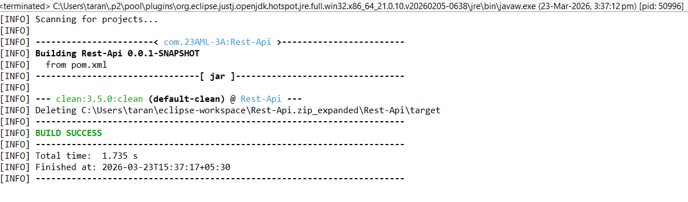
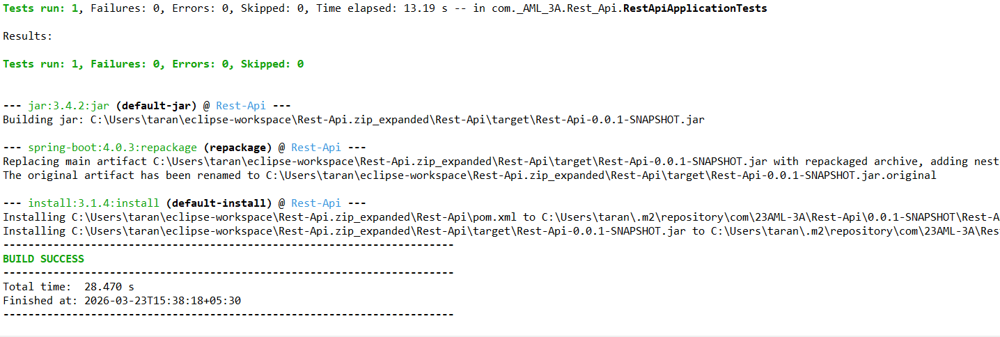
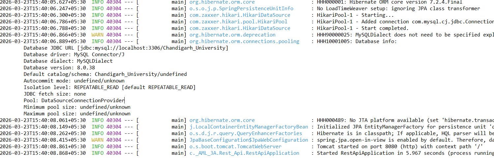
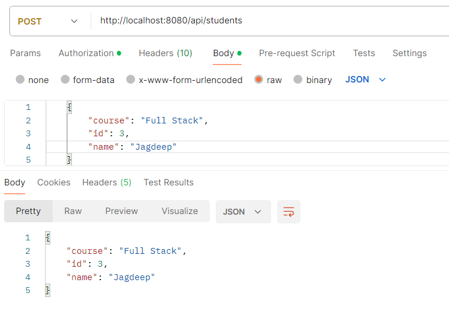
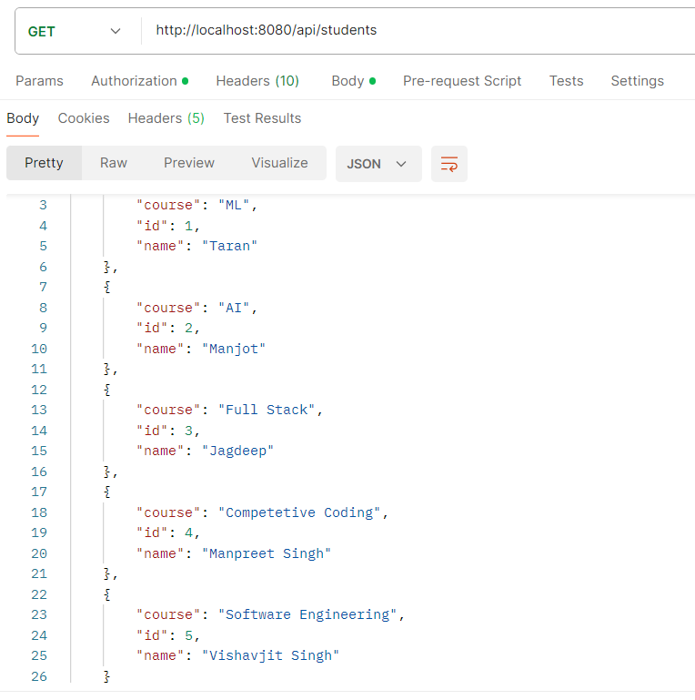
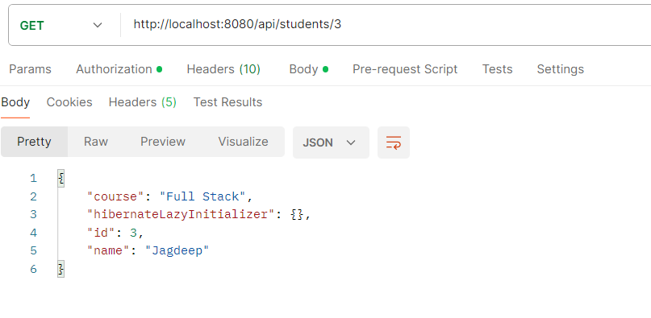
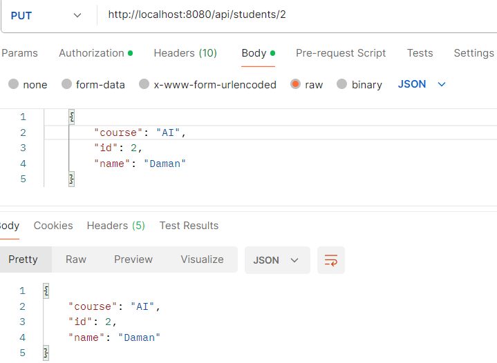
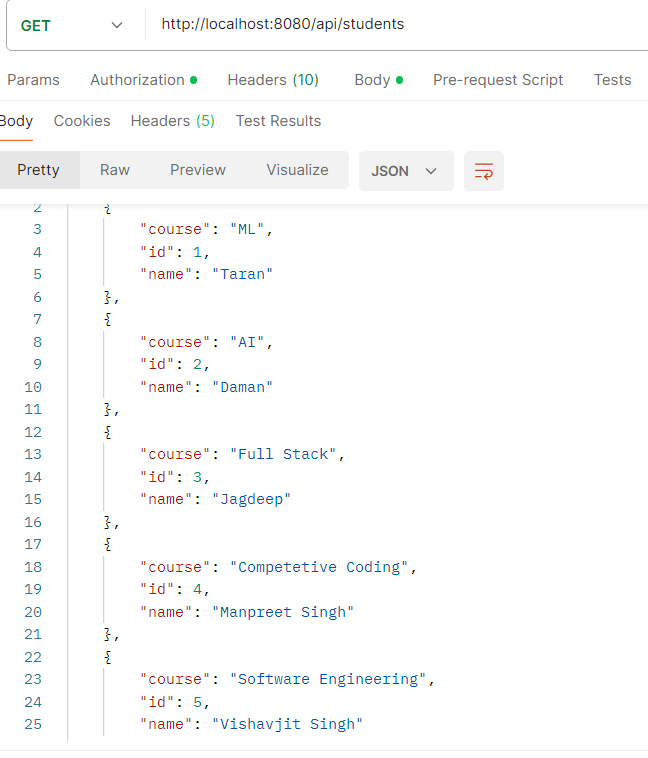
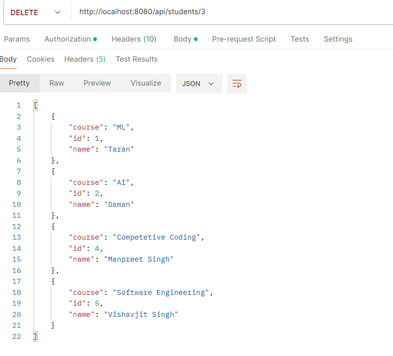

# Student REST API (Spring Boot)

This project is a **Spring Boot REST API** for managing student data using CRUD operations.

---

## Features

- Get all students  
- Get student by ID  
- Add new student  
- Update student  
- Delete student  

---

## Tech Stack

- Java  
- Spring Boot  
- Spring Data JPA  
- Hibernate  
- MySQL  
- Maven  
- Postman  

---

## API Endpoints

| Method | Endpoint | Description |
|--------|---------|------------|
| GET | /api/students | Get all students |
| GET | /api/students/{id} | Get student by ID |
| POST | /api/students | Add student |
| PUT | /api/students/{id} | Update student |
| DELETE | /api/students/{id} | Delete student |

---

## Screenshots

### Application Running

### POST - Add Student

### GET - All Students

###  GET - Student by ID

### PUT - Update Student

### GET After Update

### DELETE - Remove Student

### GET After Delete

### Additional Output / Logs

